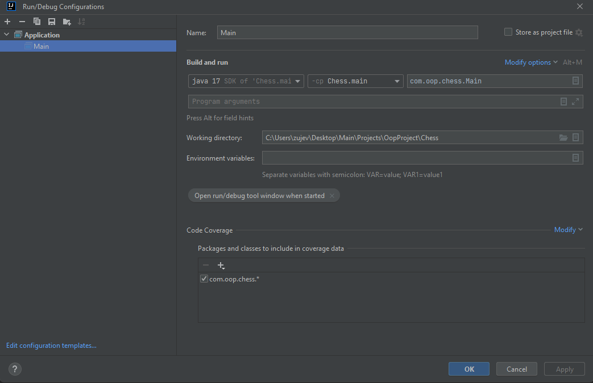
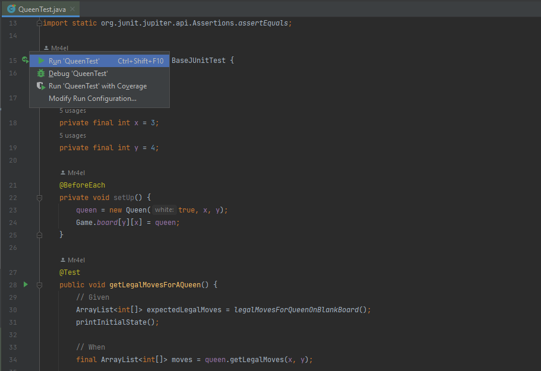
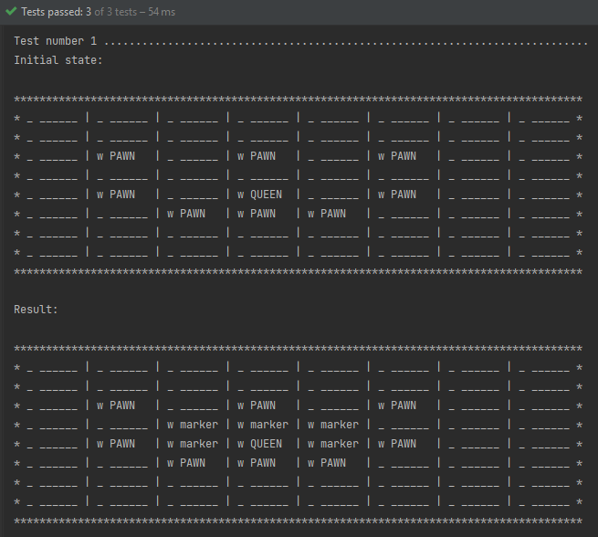

# Chess

Project created by students of the University of Latvia as part of group work for the course Object Oriented Programming\
[**Full description of the project**](https://drive.google.com/file/d/1E_F6kmqceu7Ixk1BPnRjrm_iNpRcNBdA/view?usp=sharing)

### Authors:

Mihails Kica **(mk20106)**\
Valērijs Zujevičs **(vz20009)**\
Andrejs Sizovs **(as20231)**\
Deniss Ozerskis **(do20030)**\
Rolands Ralfs Ļaudaks **(rl19071)**

## Pre requirement

1. Latest version of [**Intellij Idea Community edition**](https://www.jetbrains.com/idea/download/#section=windows)
2. Preinstalled [**Java 17**](https://www.oracle.com/java/technologies/javase/jdk17-archive-downloads.html)

## Running

### Configure Java version:

* Create ```application.properties``` file in ```src/main/resources/``` folder.\
  The folder already contains an ```application.properties.example``` file that contains all the necessary parameters
  with the correct values.
  The configuration example is also duplicated here:

```
### ChatGpt configuration
chat-gpt.api.enable = false
chat-gpt.api.url = https://api.openai.com/v1/chat/completions
chat-gpt.api.key = 
chat-gpt.api.model = gpt-3.5-turbo

### Visual search
# Display the search visually (Slower if true)
application.visual.search = false

### AI
# The values of the discount factor (LAMBDA), the learning rate (ALPHA) and the constant in the tanh function (BETA).
application.temporal.different.leaf.lambda = 0.7
application.temporal.different.leaf.alpha = 1.0
application.temporal.different.leaf.beta = 0.0025

# Gradually decrease the learning
application.temporal.different.leaf.alpha-decrease-rate = 0.01
# Equals to alpha
application.temporal.different.leaf.max-alpha = 1.0
application.temporal.different.leaf.min-alpha = 0.01
```

* If you need integration with ChatGPT, change the value of the ```chat-gpt.api.enable``` parameter to **true** and
  specify the value ```chat-gpt.api.key```, which you have to generate in your personal account [**OpenAI
  API**](https://platform.openai.com/account/api-keys).
* In the Intellij Idea, click ```Run->Edit Configurations...```
* Select java 17
* If the configuration was not created by default, create it with
  ```Run->Edit Configurations...->Add New Configuration->Application``` and configure the following settings:\
  \
  

**Note:** Make sure Gradle has downloaded all dependencies and the project is indexed by the IDE.

### Run project

* Choose a configuration and run the project
* Or go to ```com/oop/chess/Main.java``` and run main class

## Testing

### Run tests for the entire project

* From the project root, run the command ```./gradlew test```\
  Everything, the tests that have been added will be run automatically.

### Running specific tests

* Go to test module ```src/test/java/com/oop/chess```
* Select the required class and run the test with Intellij Idea\
  \
  
  \
  In this case for each test a textual representation of the board will be displayed in the console before and after
  running the test.\
  \
  

## Game Rules

1. There is no check or checkmate. The King is allowed to move to squares that are under attack by the opponent's pieces, and the game ends when one player captures the King of the other player.
2. A die is rolled for each turn to indicate which pieces the player can move. In the game, the legal piece is displayed on the right side of the screen. If the die chooses an immobile piece, it simply rolls again for the current player.
3. If the die's piece type is pawn and if a pawn is moved into the last row for promotion, it can be promoted to any piece (the piece will be promoted to the type that each player selects in the dropdown menus to the right of the GUI).
